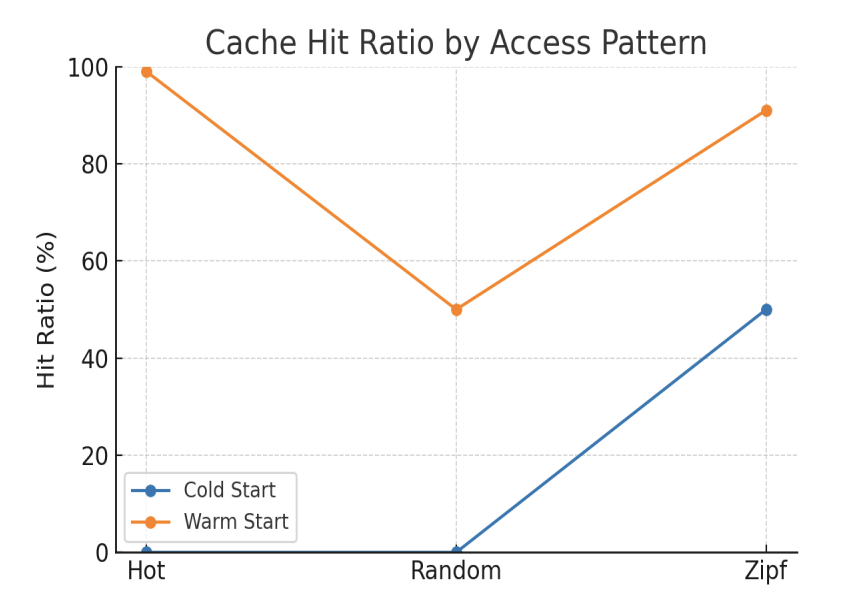

# 📰 Scalable Article Hub

A scalable backend system for managing and serving large volumes of articles.  
This project aims to explore high-performance backend architecture using Spring Boot, JPA, and JWT-based authentication.

---

## 🚀 Project Status – Week 1 ✅

- ✅ User & Post entity design (JPA)
- ✅ Basic CRUD for User and Post
- ✅ JWT-based authentication implemented
- ✅ Swagger (OpenAPI) documentation integrated
- ✅ Postman API testing completed
- ✅ @Transactional issue resolved and documented

## 🚀 Project Status – Week 2 ✅

- ✅ **Large Dataset Generation & Insertion**
    - Generated 10,000+ articles using **Faker** and inserted them into MySQL
    - Indexed all records into **Elasticsearch** for search performance testing

- ✅ **Search API Implementation**
    - **MySQL Search**: JPA with `findByTitleContainingOrContentContaining` + pagination & sorting
    - **Elasticsearch Search**: Java API Client with `MultiMatchQuery` (title, content) + author/date filters

- ✅ **Performance Testing with Postman**
    - Designed **5 test scenarios** changing `keyword`, `page`, and `size` parameters
    - Measured response time for both MySQL and Elasticsearch    

- ✅ **Performance Comparison Results**  

  | Request No.         | MySQL Time (ms) | Elasticsearch Time (ms) |
  |---------------------|----------------|--------------------------|
  | 1 (keyword=love)    | 193            | 37                       |
  | 2 (keyword=kill)    | 186            | 31                       |
  | 3 (keyword=story)   | 143            | 25                       |
  | 4 (page=1)          | 104            | 25                       |
  | 5 (size=5)          | 137            | 26                       |
  | **Average**         | **152.6**      | **28.8**                 |

    ✅ **Conclusion**: Elasticsearch achieved ~5x faster average response times compared to MySQL.

## 🚀 Project Status – Week 3 ✅

- ✅ **Redis Caching Integration**
  - Redis container launched via **docker-compose**
  - Integrated Redis into Spring Boot for **view count caching**
  - Implemented scheduler to periodically flush cached deltas back to MySQL


- ✅ **Cache Performance Testing (JMeter)**
  - Designed tests with **100 concurrent users** and different access patterns:
    - **Hot** (few popular articles repeatedly requested)
    - **Random** (uniform random requests)
    - **Zipf** (realistic skewed distribution)
    - **Cold** (no cache preloaded) vs **Warm** (cache preloaded)


- ✅ **Cache Hit/Miss Results**

  | Scenario | Cold (Hits/Misses) | Warm (Hits/Misses) |
    |----------|--------------------|--------------------|
  | Hot      | 0 / 100            | 99 / 1             |
  | Random   | 0 / 100            | 50 / 50            |
  | Zipf     | 50 / 50            | 91 / 9             |

  ✅ **Insights**
  - Caching is most effective under **Hot access pattern** (~99% hit ratio).
  - **Zipf distribution** also benefits strongly from caching.
  - Random distribution shows limited caching gains, as expected.


- ✅ **Visualization**

  

  *(Cache hit ratios for Hot, Random, Zipf under Cold vs Warm conditions)*


---

## 🛠 Tech Stack

| Layer         | Tech Used                                     |
|---------------|-----------------------------------------------|
| Backend       | Spring Boot, Spring Security                  |
| Database      | MySQL (JPA, Hibernate), Elasticsearch 8.x     |
| Auth          | JWT (access token only)                       |
| Docs/Test     | Swagger (springdoc), Postman                  |
| Build Tool    | Maven                                         |

---

## 📂 Current Structure
```aiignore
src/
└── main/
    ├── java/com/euni/articlehub/
    │   ├── controller/
    │   ├── service/
    │   ├── repository/
    │   ├── document/          # Elasticsearch documents
    │   ├── dto/
    │   ├── entity/
    │   ├── filter/
    │   └── util/
    └── resources/
        ├── application.yml
        └── static/templates (future)    
```
---

## ⚙️ How to Run

```bash
# Clone the project
git clone https://github.com/your-username/scalable-article-hub.git

# Navigate into the project
cd scalable-article-hub

# Run the Spring Boot application
./mvnw spring-boot:run
```

```
Swagger UI available at:

👉 http://localhost:8080/swagger-ui/index.html

Kibana (Elasticsearch monitoring) available at:

👉 http://localhost:5601

Redis (default port):

👉 redis://localhost:6379

RedisInsight (Redis GUI):

👉 http://localhost:5540
```

---

## 💼 About This Project

This project is part of my backend engineering portfolio, aimed at demonstrating:
- Scalable API development with Java & Spring Boot

- Performance optimization using Elasticsearch

- Secure architecture with JWT authentication

- Practical API testing using Postman